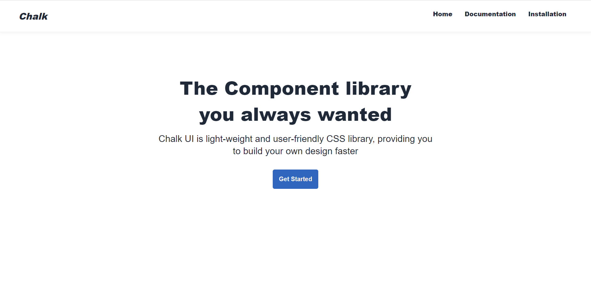

# Chalk UI

Chalk UI is an robust, customizable, and accessible library whichhelps Developers to use best styles and components you can build
your own design system and develop your dream applications faster

```

```

## Features

- Easy Installation
- Easy to Use
- Fully customisable
- Responsive

## Components

- [Avatar](https://chalkui.netlify.app/documentation.html#component-avatar)
- [Alert](https://chalkui.netlify.app/documentation.html#component-Alert)
- [Badge](https://chalkui.netlify.app/documentation.html#component-badge)
- [Button](https://chalkui.netlify.app/documentation.html#component-button)
- [Card](https://chalkui.netlify.app/documentation.html#component-card)
- [Image](https://chalkui.netlify.app/documentation.html#component-image)
- [Input](https://chalkui.netlify.app/documentation.html#component-input)
- [Toast](https://chalkui.netlify.app/documentation.html#component-toast)
- [Rating](https://chalkui.netlify.app/documentation.html#component-rating)
- [Modal](https://chalkui.netlify.app/documentation.html#component-modal)
- [List](https://chalkui.netlify.app/documentation.html#component-list)
- [Navigation](https://chalkui.netlify.app/documentation.html#component-navigation)
- [Grid](https://chalkui.netlify.app/documentation.html#component-grid)

## Technologies used

- HTML
- CSS

## How to Install

Copy and paste stylesheet link in your Project

```html
<link rel="stylesheet" href="https://chalkui.netlify.app/css/styles.css" />
```

To Know how to use Chalk in project Read [chalk UI Documentation](https://chalkui.netlify.app)
